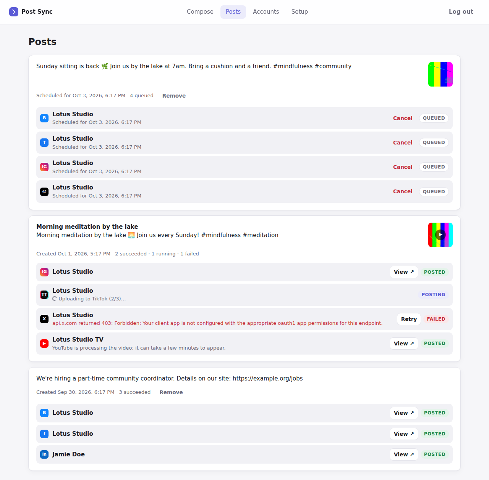

# Post Sync

Write a post once, pick where it goes, and Post Sync publishes it to **Instagram, Facebook, TikTok, YouTube,
LinkedIn, Threads, X and Bluesky** through each platform's official API.

It comes in two parts:

- **`post-social-media-sync`**, an npm package you plug into your own Node.js backend. It handles account
  logins (OAuth), uploads, validation, the publishing queue and retries, and gives your frontend an HTTP API and a
  small client SDK. Every account, upload and post belongs to an `ownerId` (your user or workspace id), so one
  instance serves all your users. You keep your own frontend.
- **The Post Sync server** (`apps/dashboard`), a ready-to-run app built on that package. Run it with its web
  dashboard to post to your own accounts, or headless (`DASHBOARD=off`) as an HTTP API for backends written in
  any language.


## Which one do I want?

| Your situation | Use |
| --- | --- |
| You have a Node.js backend (Express, Fastify, NestJS, Next.js, Hono, plain `node:http`) and want to add multi-platform posting to your product, with your own UI | **A. The package**: [embed it](#a-embed-the-package-in-your-backend) |
| Your backend is Python, PHP, Go, Ruby, Java, … | **B. The server, headless**: [run it with `DASHBOARD=off`](#headless-mode-for-any-backend) and call its HTTP API; get results by webhook |
| You just want to post to your own accounts from a web page | **B. The server, with its dashboard**: [run it](#b-run-the-server) |
| You want both: your users post from your app, you post from the dashboard | **B** with the dashboard on and `API_TOKEN` set |

Both talk to the platforms the same way. The server is the package plus login, configuration from environment
variables, webhooks and the dashboard UI.

## A. Embed the package in your backend

```bash
npm install post-social-media-sync better-sqlite3   # or pg instead of better-sqlite3 for PostgreSQL
```

```ts
import express from "express";
import { createPostSync } from "post-social-media-sync";
import { postSyncExpress } from "post-social-media-sync/express";
import { sqliteStorage } from "post-social-media-sync/sqlite";

const app = express();
app.use(yourSessionMiddleware); // whatever sets req.user today

const sync = await createPostSync({
  secret: process.env.POST_SYNC_SECRET!, // 32+ random characters; never change it
  publicUrl: "https://app.example.com/social", // where the handler is mounted (below)
  storage: sqliteStorage("./data/post-sync.db"),
  mediaDir: "./data/post-sync-media",
  platforms: {
    meta: { appId: process.env.META_APP_ID!, appSecret: process.env.META_APP_SECRET! },
    google: { clientId: process.env.GOOGLE_CLIENT_ID!, clientSecret: process.env.GOOGLE_CLIENT_SECRET! },
  },
});

app.use("/social", postSyncExpress(sync, { authenticate: (req) => req.user?.id ?? null }));
app.listen(3000);
```

Your frontend now has the API under `/social` (`/social/accounts`, `/social/posts`, …). Use it with `fetch`, or with
the client SDK:

```ts
import { createPostSyncClient } from "post-social-media-sync/client";

const social = createPostSyncClient({ baseUrl: "/social" });

// "Connect Facebook & Instagram" can be a plain link (cookie sessions):
const href = social.connect.url("meta", { returnTo: "/settings/social" });

// Upload a File from an <input type="file">, then post it:
const [video] = await social.media.upload(file, { onProgress: (fraction) => console.log(fraction) });
await social.posts.create({
  text: "New video!",
  mediaIds: [video.id],
  platforms: ["youtube", "tiktok"], // every connected account on these platforms
  platformOptions: { tiktok: { privacyLevel: "SELF_ONLY" } },
});
```

Register `https://app.example.com/social/oauth/<connector>/callback` as the redirect URI in each platform's developer
console (`sync.redirectUri("meta")` returns the exact value).

**[docs/PLUGIN.md](docs/PLUGIN.md)** is the full guide: Fastify, NestJS, Next.js, Hono/Bun/Deno and plain
`node:http`; the HTTP API; the client SDK with React examples; calling the engine from your own code and jobs;
PostgreSQL and multi-server setups; events; security. **[examples/express-host](examples/express-host)** is a
small Express app with its own login and frontend and Post Sync plugged in
(`npm start -w @post-sync/example-express-host`).

## B. Run the server

You need **Node.js 22.12+**. **ffmpeg** is recommended (video checks, thumbnails and image conversion).

```bash
npm install
cp .env.example .env          # then set ADMIN_PASSWORD (and PUBLIC_BASE_URL later)
npm run build
npm start                     # or: npm run dev   (auto-reload while developing)
```

Open <http://localhost:3000>, log in with your `ADMIN_PASSWORD`, then go to **Accounts**. **Bluesky** works
immediately with an app password, which is a good way to try a first post. The other platforms need a free
developer app each: follow **[docs/PLATFORM_SETUP.md](docs/PLATFORM_SETUP.md)**. The **Setup** tab in the dashboard
shows the redirect URI to paste into each developer console: `<PUBLIC_BASE_URL>/api/oauth/<connector>/callback`.

The server reads `.env` from the directory you start it in (the repository root for `npm start` and
`npm run dev`). Every setting is described in [.env.example](.env.example).



### With Docker

```bash
cp .env.example .env          # set ADMIN_PASSWORD, PUBLIC_BASE_URL and platform keys
docker compose up -d --build
```

Data (database, uploads, encryption key) is kept in the `postsync-data` volume.

### Giving it a public address

Platforms send the browser back to `PUBLIC_BASE_URL` after a login, most of them insist on HTTPS, and Instagram
(photos) and Threads download your media from it. So for real use, give the server a public HTTPS address:

- **VPS + domain**: run it with Docker and put [Caddy](https://caddyserver.com) in front for automatic HTTPS:
  ```
  # /etc/caddy/Caddyfile
  posts.example.com {
      reverse_proxy localhost:3000
  }
  ```
  and set `PUBLIC_BASE_URL=https://posts.example.com`.
- **From your own computer**: `cloudflared tunnel --url http://localhost:3000` (or `ngrok http 3000`) and set
  `PUBLIC_BASE_URL` to the HTTPS address it prints. `docker compose --profile tunnel up` runs the Cloudflare
  tunnel for you.

### Headless mode for any backend

Set `DASHBOARD=off` and `API_TOKEN` (16+ characters). The server then serves only the HTTP API under `/api`, and
your backend calls it with:

- `Authorization: Bearer <API_TOKEN>`, and
- `X-Owner-Id: <your user or workspace id>` to act for one of your users. Each owner only sees their own accounts,
  media and posts. Without the header, requests act for the dashboard's owner (`default`).

```bash
TOKEN=your-api-token
BASE=https://posts.example.com
H=(-H "Authorization: Bearer $TOKEN" -H "X-Owner-Id: user_42")

# 1. Connect an account: send the user's browser to the returned URL.
curl -s "${H[@]}" -H "Content-Type: application/json" $BASE/api/connect/meta \
  -d '{"returnTo": "https://app.example.com/settings"}'
# → {"url":"https://www.facebook.com/…"}   After the login the browser lands on
#   https://app.example.com/settings?postsync=connected&connector=…&count=2

# 2. Upload media (repeat -F for several files)
curl -s "${H[@]}" -F "file=@clip.mp4" $BASE/api/media
# → {"media":[{"id":"8c0e…","kind":"video",…}]}

# 3. Post to every connected account on these platforms (or "targets": [{"accountId": "…"}])
curl -s "${H[@]}" -H "Content-Type: application/json" $BASE/api/posts -d '{
  "text": "New video is up! #meditation",
  "title": "Morning meditation",
  "mediaIds": ["8c0e…"],
  "platforms": ["youtube", "tiktok", "instagram"],
  "platformOptions": { "youtube": { "privacyStatus": "public" }, "tiktok": { "privacyLevel": "SELF_ONLY" } },
  "scheduledAt": "2026-10-05T07:00:00Z"
}'

# 4. Check progress
curl -s "${H[@]}" "$BASE/api/posts?limit=5"
```

`returnTo` must be on `PUBLIC_BASE_URL` or on an origin listed in `ALLOWED_RETURN_ORIGINS`. Instead of polling, set
`WEBHOOK_URL` and `WEBHOOK_SECRET`: the server then POSTs every event (post published, failed, account needs
reconnecting, …) to your backend, signed with HMAC-SHA256. See [docs/PLUGIN.md](docs/PLUGIN.md#non-node-backends)
for the payload and signature checks in Node.js and Python, and [docs/openapi.yaml](docs/openapi.yaml) for every
endpoint.

To run several API servers, point them all at one PostgreSQL database (`DATABASE_URL`), the same `APP_SECRET` and a
shared `DATA_DIR`, and set `WORKER=off` on the ones that should not publish. See
[apps/dashboard/README.md](apps/dashboard/README.md).

## What it does

- **One composer for everything**: caption, photos or a video, optional title.
- **Many accounts per platform.** Connect several Facebook Pages, a YouTube channel, a LinkedIn profile… and choose
  the accounts for each post.
- **Checks before posting**: character limits as each platform counts them, media rules (TikTok and YouTube need
  a video, Instagram needs media, X allows 4 photos, …), aspect ratios, expired logins.
- **Per-platform settings**: YouTube visibility/category/tags/made-for-kids, TikTok privacy and
  comment/duet/stitch settings or "send to inbox", Facebook video vs Reel, Instagram "share reel to feed",
  LinkedIn visibility, and a different caption per platform if you want one.
- **Background publishing queue**: big uploads run in chunks, platform processing is awaited, temporary failures
  (rate limits, outages) are retried automatically, and failed posts can be retried.
- **Scheduling**: give a date and time and the post goes out then.
- **History** with live progress, errors in plain language, and a link to every published post.
- **Account check** that tests a login without posting anything.
- **Handles the details**: refreshes short-lived tokens, converts images Instagram won't take (PNG/WebP → JPEG),
  compresses images for Bluesky, makes hashtags/links clickable on LinkedIn and Bluesky, picks a supported
  LinkedIn API version automatically.
- **Multi-user**: everything is scoped to an owner id, so a SaaS can give every user or workspace their own
  connected accounts.

## What each platform supports

| Platform | Text only | Photos | Video | Things to know |
| --- | :-: | :-: | :-: | --- |
| Facebook | ✓ | up to 10 | 1 (video or Reel) | Pages only; Meta doesn't allow apps to post to personal profiles |
| Instagram | – | up to 10 (carousel) | Reels, or inside a carousel | Professional account linked to a Facebook Page; photos need a public URL |
| TikTok | – | – | 1 | Private ("Only me", private account) until TikTok audits your app, or send to inbox |
| YouTube | – | – | 1 | Private until Google audits your API project; vertical ≤3 min become Shorts |
| LinkedIn | ✓ | up to 20 | 1 (MP4) | Your profile; Company Pages need LinkedIn's approval |
| Threads | ✓ | up to 20 | carousel | Media posts need a public URL |
| X | ✓ | up to 4 | 1 | The X API charges for posting |
| Bluesky | ✓ | up to 4 | 1 (≤10 min) | Connect with an app password |

"A public URL" means the address the platform downloads your files from must be reachable from the internet:
`PUBLIC_BASE_URL` for the server, `publicUrl` for the package. The audit and review steps are the platforms' rules
for third-party apps, not something Post Sync can skip. For your own accounts, every platform lets you start in
development or sandbox mode (see the [setup guide](docs/PLATFORM_SETUP.md)).

## How it works

```
your frontend / dashboard / backend
        │  HTTP API (client SDK, curl, any language)
        ▼
HTTP handler ─ createHandler(), postSyncExpress(), postSyncFastify()
        │   /connect, /oauth/<connector>/callback, /media, /posts, /targets, …
        ▼
PostSync engine (createPostSync) ──► Storage: SQLite or PostgreSQL
        │                             accounts (tokens encrypted), media, posts, queue
        ├── media store (mediaDir) + signed URLs, so Instagram/Threads can fetch your files
        └── worker: publishes queued posts, one job per account at a time
               ├─ facebook.ts   Graph API: feed, photos, videos, Reels
               ├─ instagram.ts  containers → resumable Reel upload → publish
               ├─ tiktok.ts     Content Posting API, chunked upload
               ├─ youtube.ts    resumable upload (Data API v3)
               ├─ linkedin.ts   Posts/Images/Videos API (multi-part upload)
               ├─ threads.ts    containers → publish
               ├─ x.ts          v2 chunked media upload + POST /2/tweets
               └─ bluesky.ts    AT Protocol records, blobs, video service
```

- Each post becomes one job per selected account. Jobs run in the background and emit events
  (`target.started`, `target.progress`, `target.succeeded`, `target.failed`, …).
- Temporary errors (network, HTTP 5xx, rate limits) are retried after 1 and 5 minutes (3 attempts by default), or
  later if the platform says when its rate limit resets. Other errors fail right away with the platform's message.
- **No duplicate posts:** if the request that publishes a post fails in a way that leaves the outcome unknown
  (connection dropped, server error), Post Sync doesn't retry automatically. Where the platform lets us check
  (Instagram, Threads, YouTube uploads), it checks whether the post went live; otherwise it asks you to check before
  retrying. Long uploads resume where they stopped instead of starting a second copy.
- Several processes can share one PostgreSQL database: jobs are claimed atomically, a database rule allows one
  running job per account, and a job whose process died is marked failed (not silently re-posted, because it may
  already be live).
- Expired or revoked logins mark the account "needs reconnect" and emit `account.needsReconnect`.

## Upgrading from 0.1

- **Reconnect your accounts.** 0.2 keeps its data in a new database file, `DATA_DIR/post-sync.db` (0.1 used
  `DATA_DIR/app.db`), and does not import the old one. Connect your accounts again after upgrading. You can delete
  `app.db` once you no longer need the old history.
- **Update the redirect URIs** in every developer console. The dashboard's OAuth callbacks moved from
  `<PUBLIC_BASE_URL>/oauth/<connector>/callback` to `<PUBLIC_BASE_URL>/api/oauth/<connector>/callback`. The Setup
  tab shows the new values.
- Scripts using `API_TOKEN` keep working: the API is still under `/api` and, without an `X-Owner-Id` header, acts
  for the dashboard's owner. The login link is now `/api/connect/<connector>`.
- `APP_SECRET` (or the generated `DATA_DIR/.app-secret`) is still used. Keep it.

## Security

- The dashboard is protected by `ADMIN_PASSWORD` (5 wrong attempts lock that IP out for 15 minutes); sessions are
  signed, HTTP-only cookies. Run it behind HTTPS. `API_TOKEN` gives full access to every owner's data: keep it on
  your servers, never in a browser.
- When you embed the package, your `authenticate` function decides who is calling. Routes that need a user reject
  requests it returns no id for.
- Platform tokens are encrypted at rest with AES-256-GCM using the secret (`APP_SECRET` for the server, `secret`
  for the package). Back up the secret as well as the database, but keep them apart: without the secret the saved
  logins can't be read.
- Uploaded files are served only at unguessable signed URLs, because Instagram and Threads must download them.
  Anyone who has such a link can fetch that file.
- Cross-site browser requests that change data are rejected (Origin check), `returnTo` only goes back to allowed
  origins, and downloading media from URLs is off unless you allow specific hosts.

More in [docs/PLUGIN.md](docs/PLUGIN.md#security).

## Not supported (yet)

Instagram Stories, TikTok photo posts, YouTube community posts, first comments, link-preview cards on Bluesky,
analytics, and multiple dashboard users (the dashboard has one password; use the package or headless mode for
many users). Personal Facebook profiles can't be supported because Meta's API doesn't allow it.

## Repository layout

```
packages/social-sync/       the npm package "post-social-media-sync"
  src/sync.ts               the engine: createPostSync(), PostSync
  src/handler/              HTTP API as a web Request → Response handler (createHandler)
  src/adapters/             Express, Fastify and Node.js http adapters
  src/client/               client SDK for browsers and Node.js (createPostSyncClient)
  src/storage/              SQLite and PostgreSQL storage
  src/platforms/            one file per platform (login + publishing)
  test/
apps/dashboard/             "@post-sync/dashboard": the ready-to-run server
  src/                      config (env vars), auth, webhooks, server
  public/                   the web dashboard (plain HTML/CSS/JS, no build step)
  test/
examples/express-host/      an existing Express app with Post Sync plugged in
docs/
  PLUGIN.md                 integration guide for the package
  PLATFORM_SETUP.md         creating each platform's developer app
  openapi.yaml              the HTTP API
```

Adding a platform means adding one file in `packages/social-sync/src/platforms/` that exports a `Platform`
(capabilities, options, `publish()`) and, if it has its own login, a `Connector`, then listing them in
`src/platforms/index.ts`.

## Development

```bash
npm install
npm run dev          # the server with auto-reload, using the package's TypeScript sources
npm test             # vitest: platform flows against mocked APIs, storage, HTTP API, server
npm run typecheck
npm run build        # builds the package, then the server
```

Tests never call the real platform APIs and need no database server (PostgreSQL storage is tested against PGlite,
an in-process Postgres).

## Documentation

- [docs/PLUGIN.md](docs/PLUGIN.md): embedding the package (frameworks, HTTP API, client SDK, storage, events,
  security, non-Node backends)
- [docs/PLATFORM_SETUP.md](docs/PLATFORM_SETUP.md): creating the developer app for each platform
- [docs/openapi.yaml](docs/openapi.yaml): the HTTP API as an OpenAPI document
- [examples/express-host](examples/express-host): a working Express integration
- [apps/dashboard/README.md](apps/dashboard/README.md): running the server, headless mode, scaling
- [packages/social-sync/README.md](packages/social-sync/README.md): the npm package page
