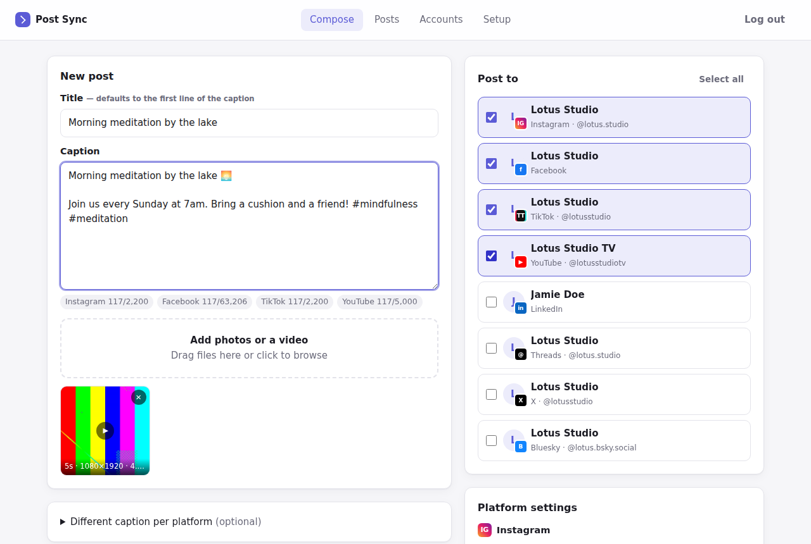

# Post Sync

Write a post once, pick where it goes, and Post Sync publishes it to **Instagram, Facebook, TikTok, YouTube,
LinkedIn, Threads, X and Bluesky** for you.

It is a small self-hosted server with a web dashboard. You run it on your computer or a cheap VPS, connect your
accounts once, and every post fans out to the accounts you tick, with live status and a link to each published
post.



## What it does

- **One composer for everything**: caption, photos or a video, optional title. Drag and drop or paste files.
- **Choose accounts per post.** Connect as many accounts as you like (several Facebook Pages, a YouTube channel,
  a LinkedIn profile…) and tick the ones this post should go to.
- **Checks before posting**: character limits as each platform counts them, media rules (TikTok and YouTube need
  a video, Instagram needs media, X allows 4 photos, …), aspect ratios, expired logins.
- **Per-platform settings**: YouTube visibility/category/tags/made-for-kids, TikTok privacy and
  comment/duet/stitch settings or "send to inbox", Facebook video vs Reel, Instagram "share reel to feed",
  LinkedIn visibility, and a different caption per platform if you want one.
- **Background publishing queue**: big uploads run in the background in chunks, platform processing is awaited,
  temporary failures (rate limits, outages) are retried automatically, and failed posts can be retried with one
  click.
- **Scheduling**: pick a date and time and the post goes out then.
- **History** with live progress, errors in plain language, and "View" links to every published post.
- **Handles the details**: refreshes short-lived tokens, converts images Instagram won't take (PNG/WebP → JPEG),
  compresses images for Bluesky, makes hashtags/links clickable on LinkedIn and Bluesky, picks a supported
  LinkedIn API version automatically.
- **API for scripts** (`Authorization: Bearer <API_TOKEN>`), so you can post from shortcuts, cron jobs or other tools.

## Quick start

You need **Node.js 22.12+**. **ffmpeg** is recommended (video checks and image conversion).

```bash
npm install
cp .env.example .env          # then set ADMIN_PASSWORD (and PUBLIC_BASE_URL later)
npm run build
npm start                     # or: npm run dev   (auto-reload while developing)
```

Open <http://localhost:3000>, log in with your `ADMIN_PASSWORD`, then go to **Accounts**.
**Bluesky** works immediately with an app password, which is a good way to try a first post. The other platforms
need a free developer app each: follow **[docs/PLATFORM_SETUP.md](docs/PLATFORM_SETUP.md)**. The **Setup** tab in
the dashboard shows the redirect URI to paste into each developer console.

### With Docker

```bash
cp .env.example .env          # set ADMIN_PASSWORD, PUBLIC_BASE_URL and platform keys
docker compose up -d --build
```

Data (database, uploads, encryption key) is kept in the `postsync-data` volume.

### Giving it a public address

Platforms send you back to `PUBLIC_BASE_URL` after you log in, most of them insist on HTTPS, and Instagram
(photos) and Threads download your media from it. So for real use, give the server a public HTTPS address:

- **VPS + domain**: run it with Docker and put [Caddy](https://caddyserver.com) in front for automatic HTTPS:
  ```
  # /etc/caddy/Caddyfile
  posts.example.com {
      reverse_proxy localhost:3000
  }
  ```
  and set `PUBLIC_BASE_URL=https://posts.example.com`.
- **From your own computer**: `cloudflared tunnel --url http://localhost:3000` (or `ngrok http 3000`) and set
  `PUBLIC_BASE_URL` to the HTTPS address it prints. `docker compose --profile tunnel up` runs the Cloudflare
  tunnel for you.

## What each platform supports

| Platform | Text only | Photos | Video | Things to know |
| --- | :-: | :-: | :-: | --- |
| Facebook | ✓ | up to 10 | 1 (video or Reel) | Pages only; Meta doesn't allow apps to post to personal profiles |
| Instagram | – | up to 10 (carousel) | Reels, or inside a carousel | Professional account linked to a Facebook Page |
| TikTok | – | – | 1 | Private ("Only me") until TikTok audits your app, or send to inbox |
| YouTube | – | – | 1 | Private until Google audits your API project; vertical ≤3 min become Shorts |
| LinkedIn | ✓ | up to 20 | 1 (MP4) | Your profile; Company Pages need LinkedIn's approval |
| Threads | ✓ | up to 20 | carousel | Media posts need a public `PUBLIC_BASE_URL` |
| X | ✓ | up to 4 | 1 | The X API charges for posting |
| Bluesky | ✓ | up to 4 | 1 (≤3 min) | Connect with an app password |

The audit and review steps are the platforms' rules for third-party apps, not something Post Sync can skip. For
your own accounts, every platform lets you start in development or sandbox mode (see the setup guide).

## Using the API

Everything the dashboard does goes through a JSON API under `/api`. Set `API_TOKEN` in `.env` to use it from
scripts:

```bash
TOKEN=your-api-token
BASE=https://posts.example.com

# 1. Upload media (repeat -F for several files)
curl -s -H "Authorization: Bearer $TOKEN" -F "file=@clip.mp4" $BASE/api/media
# → {"media":[{"id":"8c0e…","kind":"video",…}]}

# 2. Post to every connected account on the listed platforms…
curl -s -H "Authorization: Bearer $TOKEN" -H "Content-Type: application/json" $BASE/api/posts -d '{
  "text": "New video is up! #meditation",
  "title": "Morning meditation",
  "mediaIds": ["8c0e…"],
  "platforms": ["youtube", "tiktok", "instagram"],
  "platformOptions": { "youtube": { "privacyStatus": "public" }, "tiktok": { "privacyLevel": "SELF_ONLY" } },
  "scheduledAt": "2026-10-02T07:00:00Z"
}'
# …or to specific accounts: "targets": [{ "accountId": "…", "text": "optional custom caption" }]

# 3. Check progress
curl -s -H "Authorization: Bearer $TOKEN" $BASE/api/posts?limit=5
```

Other endpoints: `GET /api/accounts`, `GET /api/meta` (platforms, their options and limits),
`POST /api/posts/validate` (dry run), `POST /api/targets/:id/retry`, `POST /api/targets/:id/cancel`,
`DELETE /api/posts/:id`.

## How it works

```
Browser / script ──► Fastify server ──► SQLite (accounts, posts, queue)
                          │
                          ├── /oauth/*        logins for each platform (tokens stored encrypted)
                          ├── /media/<sig>/*  signed links so Instagram/Threads can fetch your files
                          └── worker          publishes queued posts, one job per account at a time
                                               ├─ facebook.ts   Graph API: feed, photos, videos, Reels
                                               ├─ instagram.ts  containers → resumable Reel upload → publish
                                               ├─ tiktok.ts     Content Posting API, chunked upload
                                               ├─ youtube.ts    resumable upload (Data API v3)
                                               ├─ linkedin.ts   Posts/Images/Videos API (multi-part upload)
                                               ├─ threads.ts    containers → publish
                                               ├─ x.ts          v2 chunked media upload + POST /2/tweets
                                               └─ bluesky.ts    AT Protocol records, blobs, video service
```

- Each post becomes one job per selected account. Jobs run in the background; the history page polls for
  progress.
- Temporary errors (network, HTTP 5xx, rate limits) are retried after 1, 5 and 15 minutes (`MAX_ATTEMPTS`). Other
  errors fail right away with the platform's message. Nothing is retried after the platform has accepted the
  post, so you don't get duplicates.
- If the server restarts in the middle of an upload, that job is marked failed (rather than silently re-posted),
  because the post may already be live. Check the platform, then click Retry if needed.
- Expired or revoked logins mark the account "Reconnect" in the dashboard.

## Security

- The dashboard is protected by `ADMIN_PASSWORD` (5 wrong attempts lock that IP out for 15 minutes); sessions
  are signed, HTTP-only cookies. Run it behind HTTPS.
- Platform tokens are encrypted at rest with AES-256-GCM using `APP_SECRET` (generated into
  `DATA_DIR/.app-secret` if you don't set one). Back up the data directory together with that secret.
- Uploaded files are served only at unguessable signed URLs, because Instagram/Threads must download them.
  Anyone who has such a link can fetch that file.
- Cross-site requests to the API are rejected; API scripts authenticate with `API_TOKEN`.

## Not supported (yet)

Instagram Stories, TikTok photo posts, YouTube community posts, first comments, link-preview cards on Bluesky,
analytics, and multiple dashboard users. Personal Facebook profiles can't be supported because Meta's API doesn't
allow it.

## Development

```bash
npm run dev        # start with auto-reload (tsx)
npm test           # vitest: platform request flows against mocked APIs, server/queue integration tests
npm run typecheck
```

Code layout:

```
src/
  index.ts            entry point
  app.ts              Fastify app: plugins, error handling, public media route
  config.ts           environment variables
  db.ts               SQLite schema and queries
  accounts.ts         connected accounts, token refresh
  posts.ts            validation, creating posts and jobs
  worker.ts           background publishing queue
  media.ts            uploads, ffprobe, image conversion, signed URLs
  routes/             REST API and OAuth endpoints
  platforms/          one file per platform (connector + publisher)
public/               dashboard (plain HTML/CSS/JS, no build step)
test/                 vitest tests
```

Adding a platform means adding one file in `src/platforms/` that exports a `Platform` (capabilities, options,
`publish()`) and, if it has its own login, a `Connector`, then listing them in `src/platforms/index.ts`.
